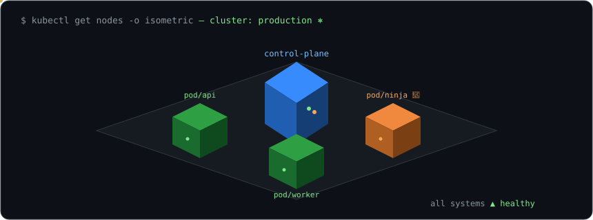
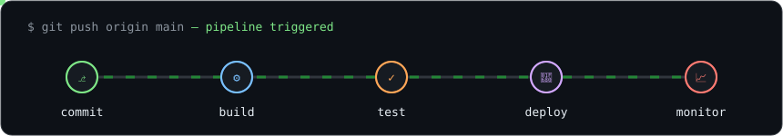

<div align="center">




</div>

<br/>

## `$ cat ashish.yaml`

```yaml
name: Ashish Yadav
role: Senior DevOps Engineer @ Razorpay
experience: 4+ years
location: India
education: B.Sc Computer Science, AKTU (2022)
currently:
  - scaling Kubernetes clusters without scaling stress
  - writing Terraform so I never click a console twice
  - turning 3am pages into automated runbooks
philosophy: "if you did it twice manually, you failed once"
ninja_way: "automate everything — dattebayo! 🍥"
```

## `$ summon shadow-clone`

<div align="center">

</div>

## `$ kubectl get skills -o wide`

```text
NAME             READY   STATUS      TOOLS                                   AGE
iac              1/1     Running     Terraform                               4y
config-mgmt      1/1     Running     Ansible                                 4y
ci-cd            2/2     Running     Jenkins, ArgoCD                         4y
containers       2/2     Running     Docker, Kubernetes (EKS)                4y
observability    3/3     Running     Prometheus, Grafana, ELK, Opensearch    4y
cloud            1/1     Running     AWS (EC2 S3 SQS Lambda IAM EKS ...)     4y
scripting        1/1     Running     Python, Bash                            4y
messaging        2/2     Running     Redis, Kafka                            3y
collaboration    1/1     Running     humans                                  ∞
```

## `$ kubectl get nodes -o isometric`

<div align="center">

</div>

## `$ watch pipeline`

<div align="center">

</div>

## `$ ttt --vs bot` 🎮

Play tic-tac-toe against my bot, right here! Click an empty cell ⬜ — it opens a
pre-filled GitHub issue, just press **Submit** and GitHub Actions plays the move
(~30s, refresh after). You are ❌. Everyone plays on the same board — team up!

<!--ttt:board-->
<div align="center">

**Your move — you are ❌, bot is ⭕**

<table>
<tr><td align="center" width="60" height="60"><a href="https://github.com/asyadav877/asyadav877/issues/new?title=ttt%7Cmove%7C0&body=Just+press+Submit+—+GitHub+Actions+plays+the+move+in+~30s.">⬜</a></td><td align="center" width="60" height="60"><a href="https://github.com/asyadav877/asyadav877/issues/new?title=ttt%7Cmove%7C1&body=Just+press+Submit+—+GitHub+Actions+plays+the+move+in+~30s.">⬜</a></td><td align="center" width="60" height="60"><a href="https://github.com/asyadav877/asyadav877/issues/new?title=ttt%7Cmove%7C2&body=Just+press+Submit+—+GitHub+Actions+plays+the+move+in+~30s.">⬜</a></td></tr>
<tr><td align="center" width="60" height="60"><a href="https://github.com/asyadav877/asyadav877/issues/new?title=ttt%7Cmove%7C3&body=Just+press+Submit+—+GitHub+Actions+plays+the+move+in+~30s.">⬜</a></td><td align="center" width="60" height="60"><a href="https://github.com/asyadav877/asyadav877/issues/new?title=ttt%7Cmove%7C4&body=Just+press+Submit+—+GitHub+Actions+plays+the+move+in+~30s.">⬜</a></td><td align="center" width="60" height="60"><a href="https://github.com/asyadav877/asyadav877/issues/new?title=ttt%7Cmove%7C5&body=Just+press+Submit+—+GitHub+Actions+plays+the+move+in+~30s.">⬜</a></td></tr>
<tr><td align="center" width="60" height="60"><a href="https://github.com/asyadav877/asyadav877/issues/new?title=ttt%7Cmove%7C6&body=Just+press+Submit+—+GitHub+Actions+plays+the+move+in+~30s.">⬜</a></td><td align="center" width="60" height="60"><a href="https://github.com/asyadav877/asyadav877/issues/new?title=ttt%7Cmove%7C7&body=Just+press+Submit+—+GitHub+Actions+plays+the+move+in+~30s.">⬜</a></td><td align="center" width="60" height="60"><a href="https://github.com/asyadav877/asyadav877/issues/new?title=ttt%7Cmove%7C8&body=Just+press+Submit+—+GitHub+Actions+plays+the+move+in+~30s.">⬜</a></td></tr>
</table>

`scoreboard → community 0 · bot 0 · draws 0`
</div>
<!--ttt:end-->

## `$ git log --stat`

<div align="center">


</div>

## `$ ping ashish`

<div align="center">

<a href="https://www.linkedin.com/in/ashish-yadav03/"></a>
<a href="mailto:yadav3.ashish@gmail.com"></a>

<br/><br/>

`64 bytes from ashish: icmp_seq=1 ttl=∞ — always up for talking infra` 🤖

**`$ exit 0`**

</div>